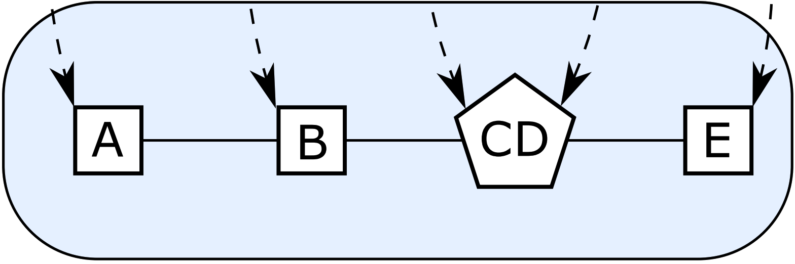

# graph-visualisation
# README in progress
Provided are different ways to draw an algebraic graph (as defined by `Algebra.Graph`) using the Haskell `Diagrams` library.

The main module `Visualise` exports two main graph drawing functions: `drawGraph` which draws a graph using the specified graph-drawing method with default `Settings` and `drawGraph'` which takes a custom `Settings` function and a custom `Vertex`-drawing function. The type `Method` has constructors for the different methods of drawing a `Graph`. The module `Visualise.ExpressionTree` however can only be used with `drawGraph` as its customisable function `drawExpressionTree'` takes extra parameters than the other modules. Also `Visualise.GraphViz` can be used to use `Data.GraphViz` to generate a `Graph` layout using the function `drawWithGraphViz` which is re-reported from the main `Visualise` module and can be bound to the `saveSVG` function to save an SVG file.

Each graph drawing module (excluding `Visualise.GraphViz`) has two drawing functions, one that uses a set of default settings and one that can be supplied with user-defined settings. These functions produce a diagram of the type defined by the Haskell `Diagrams` library. The function with default settings has the type signature of:
```Haskell
(Show a, Eq a, Countable a) => Graph a -> Diagram B
```

Meaning that it requires a graph of the type defined by `Algebra.Graph` and from this produces a `Diagram` from the `Diagrams` library. The corrisponding function which requires a `Settings`-producing function and a custom node-drawing function has the type signature of:
```Haskell
(Show a, Eq a, Countable a) => (Graph a -> Settings) -> (a -> Diagram B) -> Graph a -> Diagram B
```
The output of these functions is suitable to be given to the following `saveSVG` function.

The `Settings` type produced by the `Settings`-producing function required by `drawGraph'` has the definition:
```Haskell
data Settings = Settings { dynamicHead :: Measure Double
                         , dynamicThick :: Measure Double
                         , directed :: Directed
                         , horizontalOrientation :: Maybe Bool
                         , layerSpacing :: Maybe Double
                         , nodeSpacing :: Maybe Double
                         , graphPadding :: Maybe Double
                         , colF :: Maybe (Int -> Colour Double)
                         , bgOp :: Maybe Double
                         , initPos :: Maybe Int
                         }
```

Where arrow shafts and head sizes can be customised, the `Maybe` values are only used by some drawing functions and the directed type is given by:
```Haskell
data Directed = Directed | Undirected deriving (Eq)
```

When the standard draw function is called, the default settings associated with the module are used which dynamically change the size of the arrow heads and thickness of the arrow shafts in accordance with the number of nodes as well as setting more specific default values as per the module.

The `Visualise` module has an impure function named `saveSVG` which can be used to output a `Diagram` to an SVG file. This function has the type signature of: 
```Haskell
(Show a) => FilePath -> Dimensions -> Diagram B -> IO ()
```

This means that it requires an output file path, a set of dimensions (a tuple of `Maybe Double` values for width and height, but only one is required for a diagram to successfully be scaled) and a `Diagram`. The function will provide an IO action to create the file, which will be in the SVG format. To change the type of file format the code changes would be straightforward.

Another useful function in `Visualise` is `dynamicStyle` which produces a `Measure Double` from a default size and the size of a graph:
```Haskell
dynamicStyle :: Measure Double -> Int -> Measure Double
dynamicStyle def graphSize = def * 10/fromIntegral graphSize
```

A graph is defined like so:
```Haskell
data Graph a = Empty
             | Vertex a
             | Overlay (Graph a) (Graph a)
             | Connect (Graph a) (Graph a)
```

Where `a` can be of the type `String`, `Char`, `Int` or even `Graph b` (i.e. a vertex can be another graph, this will be discussed in the individual module descriptions).

## Tree-Like Layouts
The `Visualise.Tree` module is the most developed module.

Graphs with no cycles can be drawn as trees using the `Visualise.Tree` module which has two main drawing functions which use default settings and two extra functions which corrispond to the main two but add a `Settings`-producing function parameter and a `Vertex`-drawing function. `drawTree` draws the graph will all its connections whereas `drawTreePartialOrder` uses the Coffman-Graham algorithm to produce the layout, which removes/reduces the indirect dependancies in order to simplify the (partial order) graph. Topological ordering using Kahn's algorithm is carried out for both functions, followed then by the nodes being drawn in layers and then connected.

The `Maybe` `Settings` parameters which allow the spacing between nodes and layers, the padding around the graph, the arrowhead size/shaft thickness and whether the graph is directed (so if edges should have arrows) to be set are used. 

### Issues
* Sometimes arrows can cross nodes

## Circular Flat Graphs
The `Visualise.FlatCircle` module can be used to draw a flat graph, with each node being at a vertex of a regular polygon with n sides, where n is the number of nodes the graph has. This works best for small graphs.

The standard drawing function is `drawFlatCircle` and to provide additional `Settings` parameters and a `Vertex`-drawing function, the function `drawFlatCircle'` is also provided.

### Issues
* Currently does not work for nodes with self-loops.

## Adaptive Layout Flat Graphs
The `Visualise.FlatAdaptive` module tries to represent any flat graph in a readable way however needs more work to be fully functioning.
The two drawing functions are `drawFlatAdaptive` and `drawFlatAdaptive'` with the same `Settings` adjustments available as `Visualise.FlatCircle` plus an integer (default 1) that determines the layout mode by adjusting the initial placement of the nodes before the algorithm is executed. Currently this module can work well with some graphs but not with others - with some graphs being very spread out.

It works by grouping together connected nodes, going up in group size.

### Issues
* Collisions between nodes
* Arrows crossing each other

## Hierarchical Graphs
Hierarchical graphs can be drawn using the `Visualise.Hierarchical` module. 

When two adjacent graphs are overlayed they are placed next to each other within a box, and when two adjacent graphs are connected their boxes are placed next to each other and connected with an arrow.

The two drawing functions are `drawHierarchical` and `drawHierarchical'`, but this time more settings can be defined when using the `drawHierarchical'` function. As well as arrow and head sizes being user-defineable, the background opacity for the boxes can also be defined (with the type of `Double`, which can be useful for if the colour for all boxes is the same as it will darken them with each layer) and a background colour choosing function can be supplied. This function is used with each layer to determine the the background colour, and has the type signature `Int -> Colour Double`, where the integer supplied is the depth of the current layer.

The arrow settings defaults are the same as the other drawing modules, the default opacity is `1` and the default colour choosing function alternates between blue and red for each layer.

### Issues
* Currently only works with DAGs

## Expression Trees
Visualises an algebraic 'Graph' expression as an expression tree: each 'Vertex' is a leaf and are joined by a node which is represented by a different 'Diagram' depending on if the two vertices are joined by a 'Connect' or an 'Overlay'. 
By default 'Connect' is represented by a '\*' in a circle and 'Overlay' is represented by a '+' in a circle.

Like the other modules there is a function which draws the `Graph` representation with default `Settings`: `drawExpressionTree`. However the customisable function `drawExpressionTree'` takes extra parameters and has the type signature:
```Haskell
drawExpressionTree' :: (Show a, Countable a) => Diagram B              -- ^ The default 'Empty' node 'Diagram'.
                                             -> (a -> Diagram B)       -- ^ A function which takes a vertex and produces a node 'Diagram'.
                                             -> Diagram B              -- ^ A 'Diagram' used for linking two expression tree branches when "Overlay" is used, by default 'defaultOverlayDiagram' is used (a circle containing a '+').
                                             -> Diagram B              -- ^ A 'Diagram' used for linking two expression tree branches when "Connect" is used, by default 'defaultConnectDiagram' is used (a circle containing a '*').
                                             -> Graph a                -- ^ The 'Graph' to be visualised as an expression tree.
                                             -> Diagram B              -- ^ The resultant expression tree 'Diagram'.
```

## GraphViz Integration
There is a extra module which uses `Data.GraphViz` to get the layout of a graph and draws it using `Diagrams` with the help of the `diagrams-graphviz` library. The drawing function is called `drawWithGraphViz` and takes the `GraphvizCommand` to be used (see [here](https://hackage.haskell.org/package/graphviz-2999.20.0.2/docs/Data-GraphViz-Attributes-Complete.html#t:GraphvizCommand)).

# Testing

## GraphGen
GraphGen is a small Java program which generates a random graph to be used for testing with a given number of layers.

## Example Drawings
* The graphs from figure 3 in the [FDL paper](https://github.com/tuura/fdl17-paper) will be drawn using `Visualise.DAG`.
The table below gives the figures from the paper on the left and their visualisations using `graph-visualisation` on the right:

<table>
    <tr>
        <td></td>
        <td></td>
    </tr>
    <tr>
        <td></td>
        <td></td>
    </tr>
    <tr>
        <td></td>
        <td></td>
    </tr>
    <tr>
        <td></td>
        <td></td>
    </tr>
</table>

## Graph Benchmarks
A set of graphs will be drawn by each of the algorithms, as required, the graphs are of the type defined in `Algebra.Graph`:
* Firstly the partial order graph `(1 * ((2 * ((4 * 7) + (5 * 7))) + (3 * (6 * (5 * 7)))))`

### With `Visualise.FlatAdaptive`


### With `Visualise.FlatCircle`


### With `Visualise.Tree`
#### With `drawTree'` and `drawTreePartialOrder` respectively

<table>
	<tr>
		<td></td>
		<td></td>
	</tr>
</table>

`drawTree'` was used instead of `drawTree` with to produce reduced arrow and node overlaps by reducing the spacing between layers and increasing the spacing within layers, while maintaining default arrow characteristics from `defaultSettings`.

### With `Visualise.Hierarchical`


### With `Visualise.ExpressionTree`
